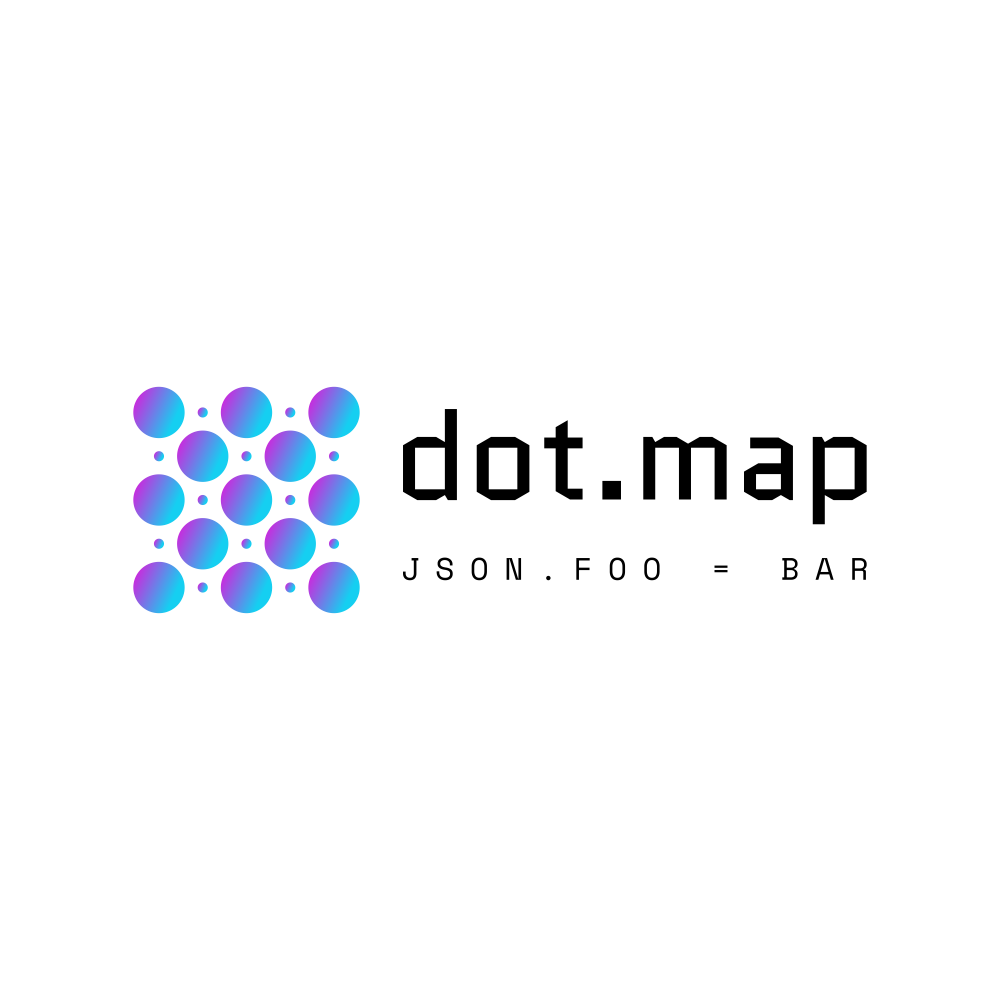

<p align="center" style="text-align: center">
  
  <h3 align="center"><b>dotmap</b></h3>
  <p align="center">A Dot notation compatible concurrent safe Hashmap in pure Go</p>
</p>

<p align="center">
  <a href="https://github.com/zerjioang/dotmap/blob/develop/LICENSE">
    
  </a>
</p>

## Latest release

[**Download**](https://github.com/zerjioang/dotmap/releases)

## TL;DR

```go
package main

import (
	"fmt"
	"github.com/zerjioang/dotmap"
)

func main(){
	mm := dotmap.New()
	mm.Reset(map[string]interface{}{
		"foo": "bar",
		"enableDebug": false,
		"version": 1.0,
		"config": map[string]interface{}{
			"http": 2,
		},
	})
	v, found := dotmap.GetDotMap(mm, "config.http")
	fmt.Println("key found: ", found)
	fmt.Println("key value: ", v)
	v2, found2 := dotmap.GetDotMap(mm, "config.key")
	fmt.Println("key found: ", found2)
	fmt.Println("key value: ", v2)
}
```

and prints in terminal std out:

```bash
key found:  true
key value:  2
key found:  false
key value:  <nil>
```

## Licenses

All rights reserved to @zerjioang under GNU GPL v3 license

Redistribution and use in source and binary forms, with or without modification, are permitted provided that the following conditions are met:

 * Redistributions of source code must retain the above copyright notice, this list of conditions and the following disclaimer.
 * Redistributions in binary form must reproduce the above copyright notice, this list of conditions and the following disclaimer in the documentation and/or other materials provided with the distribution.
 * Uses GPLv3 license described below

This program is free software: you can redistribute it and/or modify it under the terms of the GNU General Public License as published by the Free Software Foundation, either version 3 of the License, or (at your option) any later version.
